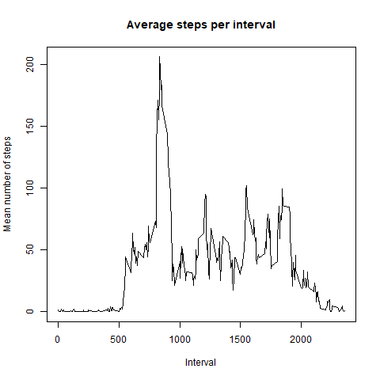

## Loading and preprocessing the data
```{r load, echo = TRUE}
library(readr)
library(dplyr)

activity <- read.csv(unzip("activity.zip"))

```
The above code loads the data from the zip file.


## What is mean total number of steps taken per day?
```{r average, echo = TRUE}
# Total steps per day
daily_steps <- activity %>% 
  filter(!is.na(steps)) %>%
  group_by(date) %>%
  summarise(total_steps = sum(steps))

daily_steps

# Histogram of total steps per day
hist(x = daily_steps$total_steps,
     main = "Daily steps",
     xlab = "Total number of steps per day",
     ylim = c(0,30))

# Calculated mean and median number of steps per day
average_steps <- activity %>% 
  filter(!is.na(steps)) %>%
  group_by(date) %>%
  summarise(mean_steps = mean(steps),
            median_steps = median(steps))

average_steps
```


## What is the average daily activity pattern?
```{r interval, echo = FALSE}
library(png)

# Time series plot of mean steps per interval
png("interval_graph.png")

interval_breakdown <- activity %>%
  group_by(interval) %>%
  summarise(mean_steps = mean(steps, na.rm = TRUE))

plot(interval_breakdown$interval, 
     interval_breakdown$mean_steps, type = "l",
     main = "Average steps per interval",
     xlab = "Interval",
     ylab = "Mean number of steps")
dev.off()

# Calculating interval with highest mean number of steps
max_steps <- interval_breakdown %>%
  filter(mean_steps == max(mean_steps)) %>%
  select(interval)
```


The mean number of steps peaked at interval `r max_steps`.

## Imputing missing values
```{r missing, echo = TRUE}
# Calculating total number of missing values
missing <- sum(!(complete.cases(activity)))

# Replaced NAs with mean steps per interval
activity_new <- activity %>%
  group_by(interval) %>%
  mutate(steps = ifelse(is.na(steps), mean(steps), steps))

# Calculating total number of steps taken each day
daily_steps_new <- activity_new %>%
  group_by(date) %>%
  summarise(total_steps = sum(steps))

# Histogram of total steps per day
hist(x = daily_steps_new$total_steps,
     main = "Daily steps",
     xlab = "Total number of steps per day",
     ylim = c(0,30))

## Calculated mean and median number of steps per day
average_steps_new <- activity_new %>%
  group_by(date) %>%
  summarise(mean_steps = mean(steps),
            median_steps = median(steps))
```
There are `r missing` missing values in the dataset.

The means and medians calculated above are the same as those initially calculated. The daily totals have not changed either.

## Are there differences in activity patterns between weekdays and weekends?
```{r week, echo = TRUE}
library(lubridate)
library(ggplot2)

# Created variable which confirms whether a given date is a weekday or weekend day.
activity_new <- activity_new %>%
  mutate(date = ymd(date)) %>%
  mutate(day = ifelse(weekdays(date) %in% c("Saturday", "Sunday"), 
                      "Weekend", "Weekday"))


## Creating panel plot of mean steps broken down by interval and type of day
par(mfrow = c(2, 2))

weekday_breakdown <- activity_new %>%
  group_by(interval, day) %>%
  summarise(mean_steps = mean(steps, na.rm = TRUE))

weekday_graph <- ggplot(weekday_breakdown, aes(interval, mean_steps)) +
  geom_line() +
  facet_wrap(~ day) +
  xlab("Interval") + ylab("Mean number of steps")

ggsave("weekday_graph.png")
```


The figures for both weekdays and weekends peaked at an interval between 750 and 1000.The maximum mean for weekdays is over 50 steps higher than that of weekends.