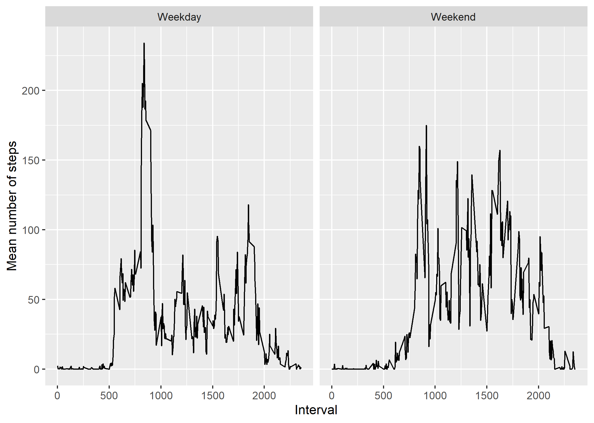

## Loading and preprocessing the data

```r
library(readr)
library(dplyr)
```

```
## 
## Attaching package: 'dplyr'
```

```
## The following objects are masked from 'package:stats':
## 
##     filter, lag
```

```
## The following objects are masked from 'package:base':
## 
##     intersect, setdiff, setequal, union
```

```r
activity <- read.csv(unzip("activity.zip"))
```
The above code loads the data from the zip file.


## What is mean total number of steps taken per day?

```r
# Total steps per day
daily_steps <- activity %>% 
  filter(!is.na(steps)) %>%
  group_by(date) %>%
  summarise(total_steps = sum(steps))

daily_steps
```

```
## # A tibble: 53 x 2
##    date       total_steps
##    <chr>            <int>
##  1 2012-10-02         126
##  2 2012-10-03       11352
##  3 2012-10-04       12116
##  4 2012-10-05       13294
##  5 2012-10-06       15420
##  6 2012-10-07       11015
##  7 2012-10-09       12811
##  8 2012-10-10        9900
##  9 2012-10-11       10304
## 10 2012-10-12       17382
## # ... with 43 more rows
```

```r
# Histogram of total steps per day
hist(x = daily_steps$total_steps,
     main = "Daily steps",
     xlab = "Total number of steps per day",
     ylim = c(0,30))
```

<!-- -->

```r
# Calculated mean and median number of steps per day
average_steps <- activity %>% 
  filter(!is.na(steps)) %>%
  group_by(date) %>%
  summarise(mean_steps = mean(steps),
            median_steps = median(steps))

average_steps
```

```
## # A tibble: 53 x 3
##    date       mean_steps median_steps
##    <chr>           <dbl>        <dbl>
##  1 2012-10-02      0.438            0
##  2 2012-10-03     39.4              0
##  3 2012-10-04     42.1              0
##  4 2012-10-05     46.2              0
##  5 2012-10-06     53.5              0
##  6 2012-10-07     38.2              0
##  7 2012-10-09     44.5              0
##  8 2012-10-10     34.4              0
##  9 2012-10-11     35.8              0
## 10 2012-10-12     60.4              0
## # ... with 43 more rows
```


## What is the average daily activity pattern?

```
## Warning: package 'png' was built under R version 4.1.1
```

```
## png 
##   2
```


The mean number of steps peaked at interval 835.

## Imputing missing values

```r
# Calculating total number of missing values
missing <- sum(!(complete.cases(activity)))

# Replaced NAs with mean steps per interval
activity_new <- activity %>%
  group_by(interval) %>%
  mutate(steps = ifelse(is.na(steps), mean(steps), steps))

# Calculating total number of steps taken each day
daily_steps_new <- activity_new %>%
  group_by(date) %>%
  summarise(total_steps = sum(steps))

# Histogram of total steps per day
hist(x = daily_steps_new$total_steps,
     main = "Daily steps",
     xlab = "Total number of steps per day",
     ylim = c(0,30))
```

<!-- -->

```r
## Calculated mean and median number of steps per day
average_steps_new <- activity_new %>%
  group_by(date) %>%
  summarise(mean_steps = mean(steps),
            median_steps = median(steps))
```
There are 2304 missing values in the dataset.

The means and medians calculated above are the same as those initially calculated. The daily totals have not changed either.

## Are there differences in activity patterns between weekdays and weekends?

```r
library(lubridate)
```

```
## Warning: package 'lubridate' was built under R version 4.1.1
```

```
## 
## Attaching package: 'lubridate'
```

```
## The following objects are masked from 'package:base':
## 
##     date, intersect, setdiff, union
```

```r
library(ggplot2)

# Created variable which confirms whether a given date is a weekday or weekend day.
activity_new <- activity_new %>%
  mutate(date = ymd(date)) %>%
  mutate(day = ifelse(weekdays(date) %in% c("Saturday", "Sunday"), 
                      "Weekend", "Weekday"))


## Creating panel plot of mean steps broken down by interval and type of day
par(mfrow = c(2, 2))

weekday_breakdown <- activity_new %>%
  group_by(interval, day) %>%
  summarise(mean_steps = mean(steps, na.rm = TRUE))
```

```
## `summarise()` has grouped output by 'interval'. You can override using the `.groups` argument.
```

```r
weekday_graph <- ggplot(weekday_breakdown, aes(interval, mean_steps)) +
  geom_line() +
  facet_wrap(~ day) +
  xlab("Interval") + ylab("Mean number of steps")

ggsave("weekday_graph.png")
```

```
## Saving 7 x 5 in image
```


The figures for both weekdays and weekends peaked at an interval between 750 and 1000.The maximum mean for weekdays is over 50 steps higher than that of weekends.
